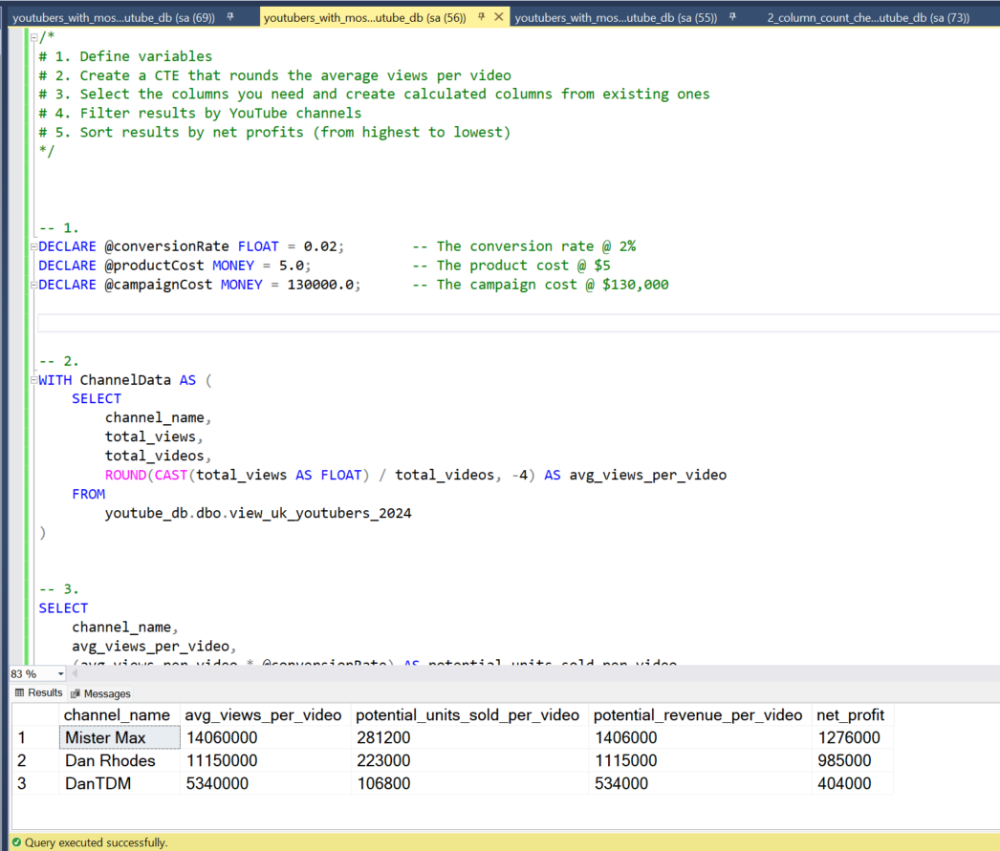

# Data Portofolio Project: Excel, SQL, PowerBi


# Objective 
- What is the key pain point?
The Head of Marketing wants to identify the top YouTubers in the UK market for 2024. This information will be crucial in guiding future marketing campaign decisions for the year.

- What is the ideal solution?
A dashboard will be ideal in this situation as it will provide easy access to insights like:
- subscriber count
- total views
- total videos
- engagement metrics

# Data Source

- What data is needed to achieve our objective?
  We need data on the top YouTubers for the UK in 2024 that includes their:
- channel_names
- total_subscribers
- total_views
- total_videos_uploaded

The data is sourced from Kaggle, [access it here.](https://www.kaggle.com/datasets/bhavyadhingra00020/top-100-social-media-influencers-2024-countrywise?resource=download)

# Stages
- Design
- Development
- Testing
- Analysis

# Design
## Dashboard components required
- What should the dashboard contain based on the requirements provided?

To understand what it should contain, we have to figure out what questions we need the dashboard to answer:

1. Who are the top 10 YouTubers with the most subscribers?
2. Which 3 channels have uploaded the most videos?
3. Which 3 channels have the most views?
4. Which 3 channels have the highest average views per video?
5. Which 3 channels have the highest views per subscriber ratio?
6. Which 3 channels have the highest subscriber engagement rate per video uploaded?

These questions need answers. As we progress, they may need to be reconsidered.

## Dashboard mockup

- What should it look like?

Some visuals that may be appropriate for answering our questions include:

1. Table
2. Treemap
3. Scorecards
4. Horizontal bar chart

## Tools 

| Tool | Purpose |
| --- | --- |
| Excel | Exploration, Testing |
| SQL Server & SSMS | Cleaning, Testing, Analyzing | 
| Power BI | Visualizing the data in an interactive dashboard | 
| GitHub | Hosting the project documentation and version control | 

# Development

## Pseudocode

- What's the general approach in creating the solution from start to finish?

1. Get the data
2. Explore the data in Excel
3. Load the data into SQL Server
4. Clean the data with SQL
5. Test the data with SQL
6. Visualize the data in PowerBi
7. Generate the findings based on the insights
8. Write the documentation and commentary
9. Publish the data to GitHub Pages

## Data exploration notes

This is the stage where we scan the data for errors, inconsistencies, bugs, weird and corrupted characters, etc.

- Initial observations:
1. There are at least 4 columns that contain the data we need for this analysis, we don't need to gather any more data.
2. The first column contains the channel ID with what appears to be the channels IDS, separated by a @ symbol - we need to extract the channel name from this.
3. Some of the cell header names are in a different language - we need to address them.
4. We have more data than we need, we would have to drop some of the columns.

## Data Cleaning
- What do we expect the clean data to look like?

The aim is to refine our dataset to ensure it is structured and ready for analysis.

The cleaned data should meet the following criteria and constraints: 

- Only relevant columns should be retained.
- All data types should be appropriate for the contents of each column.
- No column should contain null values, indicating complete data for all records

Data constraints on the cleaned dataset:

| Property | Description |
| --- | --- |
| Number of rows | 100 |
| Number of columns | 4 |

Tabular representations of the expected schema for the clean data: 

| Column name  | Description |
| --- | --- |
| channel_name | VARCHAR | NO |
| total_subscribers | INTEGER | NO |
| total_views | INTEGER | NO |
| total_videos | INTEGER | NO |

- What steps are needed to clean and shape the data into the desired format?

1. Remove unnecessary columns by only selecting the ones you need
2. Extract YouTube channel names from the first column
3. Rename columns using aliases


### Transform the data

```SQL
/*
# 1. Extract the channel name from the 'NOMBRE' column
# 2. Select the required columns
*/

-- 1.
SELECT
    SUBSTRING(NOMBRE, 1, CHARINDEX('@', NOMBRE) -1) AS channel_name,
-- 2.
    total_subscribers,
    total_views,
    total_videos

FROM
    top_uk_youtubers_2024
```

### Create the SQL view

```SQL
/*
# 1. Create a view to store the transformed data
# 2. Cast the extracted channel name as VARCHAR(100)
# 3. Select the required columns from the top_uk_youtubers_2024 SQL table 
*/

-- 1.
CREATE VIEW view_uk_youtubers_2024 AS

-- 2.
SELECT
    CAST(SUBSTRING(NOMBRE, 1, CHARINDEX('@', NOMBRE) -1) AS VARCHAR(100)) AS channel_name,

-- 3.
    total_subscribers,
    total_views,
    total_videos
FROM
    top_uk_youtubers_2024

```

# Testing

- Data quality and validation checks

## Row count check
```SQL
/*
# Count the total number of records (or rows) in the SQL view
*/

SELECT
    COUNT(*) AS no_of_rows
FROM
    view_uk_youtubers_2024;

```


## Column count check
### SQL query
```SQL
/*
# Count the total number of columns (or fields) in the SQL view
*/

SELECT
    COUNT(*) AS column_count
FROM
    INFORMATION_SCHEMA.COLUMNS
WHERE
    TABLE_NAME = 'view_uk_youtubers_2024'
```
### Output 


## Data type check
### SQL query
```SQL
/*
# Check the data types of each column from the view by checking the INFORMATION SCHEMA view
*/

-- 1.
SELECT
    COLUMN_NAME,
    DATA_TYPE
FROM
    INFORMATION_SCHEMA.COLUMNS
WHERE
    TABLE_NAME = 'view_uk_youtubers_2024';
```
### Output


## Duplicate count check
### SQL query 
```SQL
/*
# 1. Check for duplicate rows in the view
# 2. Group by the channel name
# 3. Filter for groups with more than one row
*/

-- 1.
SELECT
    channel_name,
    COUNT(*) AS duplicate_count
FROM
    view_uk_youtubers_2024

-- 2.
GROUP BY
    channel_name

-- 3.
HAVING
    COUNT(*) > 1;
```
### Output


## DAX Measures

### 1. Total Subscribers (M)
```SQL
Total Subscribers (M) = 
VAR million = 1000000
VAR sumOfSubscribers = SUM(view_uk_youtubers_2024[total_subscribers])
VAR totalSubscribers = DIVIDE(sumOfSubscribers,million)

RETURN totalSubscribers

```

### 2. Total Views (B)
```sql
Total Views (B) = 
VAR billion = 1000000000
VAR sumOfTotalViews = SUM(view_uk_youtubers_2024[total_views])
VAR totalViews = ROUND(sumOfTotalViews / billion, 2)

RETURN totalViews

```

### 3. Total Videos
```SQL
Total Videos = 
VAR totalVideos = SUM(view_uk_youtubers_2024[total_videos])

RETURN totalVideos

```

### 4. Average Views Per Video (M)
```SQL
Average Views per Video (M) = 
VAR sumOfTotalViews = SUM(view_uk_youtubers_2024[total_views])
VAR sumOfTotalVideos = SUM(view_uk_youtubers_2024[total_videos])
VAR  avgViewsPerVideo = DIVIDE(sumOfTotalViews,sumOfTotalVideos, BLANK())
VAR finalAvgViewsPerVideo = DIVIDE(avgViewsPerVideo, 1000000, BLANK())

RETURN finalAvgViewsPerVideo 

```

### 5. Subscriber Engagement Rate
```SQL
Subscriber Engagement Rate = 
VAR sumOfTotalSubscribers = SUM(view_uk_youtubers_2024[total_subscribers])
VAR sumOfTotalVideos = SUM(view_uk_youtubers_2024[total_videos])
VAR subscriberEngRate = DIVIDE(sumOfTotalSubscribers, sumOfTotalVideos, BLANK())

RETURN subscriberEngRate 

```

### 6. Views per subscriber
```SQL
Views Per Subscriber = 
VAR sumOfTotalViews = SUM(view_uk_youtubers_2024[total_views])
VAR sumOfTotalSubscribers = SUM(view_uk_youtubers_2024[total_subscribers])
VAR viewsPerSubscriber = DIVIDE(sumOfTotalViews, sumOfTotalSubscribers, BLANK())

RETURN viewsPerSubscriber 

```

# Analysis

## Findings

For this analysis, we will concentrate on the questions listed below:
1. Who are the top 10 YouTubers with the most subscribers?
2. Which 3 channels have uploaded the most videos?
3. Which 3 channels have the most views?
4. Which 3 channels have the highest average views per video?
5. Which 3 channels have the highest views per subscriber ratio?
6. Which 3 channels have the highest subscriber engagement rate per video uploaded?

### 1. Who are the top 10 YouTubers with the most subscribers?

| Rank | Channel Name         | Subscribers (M) |
|------|----------------------|-----------------|
| 1    | NoCopyrightSounds    | 33.60           |
| 2    | DanTDM               | 28.60           |
| 3    | Dan Rhodes           | 26.50           |
| 4    | Miss Katy            | 24.50           |
| 5    | Mister Max           | 24.40           |
| 6    | KSI                  | 24.10           |
| 7    | Jelly                | 23.50           |
| 8    | Dua Lipa             | 23.30           |
| 9    | Sidemen              | 21.00           |
| 10   | Ali-A                | 18.90           |

### 2. Which 3 channels have uploaded the most videos?

| Rank | Channel Name    | Videos Uploaded |
|------|-----------------|-----------------|
| 1    | GRM Daily       | 14,696          |
| 2    | Manchester City | 8,248           |
| 3    | Yogscast        | 6,435           |

### 3. Which 3 channels have the most views?


| Rank | Channel Name | Total Views (B) |
|------|--------------|-----------------|
| 1    | DanTDM       | 19.78           |
| 2    | Dan Rhodes   | 18.56           |
| 3    | Mister Max   | 15.97           |

### 4. Which 3 channels have the highest average views per video?

| Channel Name | Average Views per Video (M) |
|--------------|-----------------|
| Mark Ronson  | 32.27           |
| Jessie J     | 5.97            |
| Dua Lipa     | 5.76            |

### 5. Which 3 channels have the highest views per subscriber ratio?

| Rank | Channel Name       | Views per Subscriber        |
|------|-----------------   |---------------------------- |
| 1    | GRM Daily          | 1185.79                     |
| 2    | Nickelodeon        | 1061.04                     |
| 3    | Disney Junior UK   | 1031.97                     |

### 6. Which 3 channels have the highest subscriber engagement rate per video uploaded?

| Rank | Channel Name    | Subscriber Engagement Rate  |
|------|-----------------|---------------------------- |
| 1    | Mark Ronson     | 343,000                     |
| 2    | Jessie J        | 110,416.67                  |
| 3    | Dua Lipa        | 104,954.95                  |


## Validation 

### 1. Youtubers with the most subscribers 

#### Calculation breakdown

Campaign idea = product placement 

1. NoCopyrightSounds 
- Average views per video = 6.92 million
- Product cost = $5
- Potential units sold per video = 6.92 million x 2% conversion rate = 138,400 units sold
- Potential revenue per video = 138,400 x $5 = $692,000
- Campaign cost (one-time fee) = $50,000
- **Net profit = $692,000 - $50,000 = $642,000**

b. DanTDM

- Average views per video = 5.34 million
- Product cost = $5
- Potential units sold per video = 5.34 million x 2% conversion rate = 106,800 units sold
- Potential revenue per video = 106,800 x $5 = $534,000
- Campaign cost (one-time fee) = $50,000
- **Net profit = $534,000 - $50,000 = $484,000**

c. Dan Rhodes

- Average views per video = 11.15 million
- Product cost = $5
- Potential units sold per video = 11.15 million x 2% conversion rate = 223,000 units sold
- Potential revenue per video = 223,000 x $5 = $1,115,000
- Campaign cost (one-time fee) = $50,000
- **Net profit = $1,115,000 - $50,000 = $1,065,000**

#### SQL query 

```SQL
/* 

# 1. Define variables 
# 2. Create a CTE that rounds the average views per video 
# 3. Select the column you need and create calculated columns from existing ones 
# 4. Filter results by YouTube channels
# 5. Sort results by net profits (from highest to lowest)

*/
-- 1. 
DECLARE @conversionRate FLOAT = 0.02;		  -- The conversion rate @ 2%
DECLARE @productCost FLOAT = 5.0;			    -- The product cost @ $5
DECLARE @campaignCost FLOAT = 50000.0;		-- The campaign cost @ $50,000	


-- 2.  
WITH ChannelData AS (
    SELECT 
        channel_name,
        total_views,
        total_videos,
        ROUND((CAST(total_views AS FLOAT) / total_videos), -4) AS rounded_avg_views_per_video
    FROM 
        youtube_db.dbo.view_uk_youtubers_2024
)

-- 3. 
SELECT 
    channel_name,
    rounded_avg_views_per_video,
    (rounded_avg_views_per_video * @conversionRate) AS potential_units_sold_per_video,
    (rounded_avg_views_per_video * @conversionRate * @productCost) AS potential_revenue_per_video,
    ((rounded_avg_views_per_video * @conversionRate * @productCost) - @campaignCost) AS net_profit
FROM 
    ChannelData


-- 4. 
WHERE 
    channel_name in ('NoCopyrightSounds', 'DanTDM', 'Dan Rhodes')    


-- 5.  
ORDER BY
	net_profit DESC

```

#### Output


### 2. Youtubers with the most videos uploaded

### Calculation breakdown 

Campaign idea = sponsored video series  

1. GRM Daily
- Average views per video = 510,000
- Product cost = $5
- Potential units sold per video = 510,000 x 2% conversion rate = 10,200 units sold
- Potential revenue per video = 10,200 x $5= $51,000
- Campaign cost (11-videos @ $5,000 each) = $55,000
- **Net profit = $51,000 - $55,000 = -$4,000 (potential loss)**

b. **Manchester City**

- Average views per video = 240,000
- Product cost = $5
- Potential units sold per video = 240,000 x 2% conversion rate = 4,800 units sold
- Potential revenue per video = 4,800 x $5= $24,000
- Campaign cost (11-videos @ $5,000 each) = $55,000
- **Net profit = $24,000 - $55,000 = -$31,000 (potential loss)**

b. **Yogscast**

- Average views per video = 710,000
- Product cost = $5
- Potential units sold per video = 710,000 x 2% conversion rate = 14,200 units sold
- Potential revenue per video = 14,200 x $5= $71,000
- Campaign cost (11-videos @ $5,000 each) = $55,000
- **Net profit = $71,000 - $55,000 = $16,000 (profit)**


Best option from category: Yogscast


#### SQL query 
```SQL
/* 
# 1. Define variables
# 2. Create a CTE that rounds the average views per video
# 3. Select the columns you need and create calculated columns from existing ones
# 4. Filter results by YouTube channels
# 5. Sort results by net profits (from highest to lowest)
*/


-- 1.
DECLARE @conversionRate FLOAT = 0.02;           -- The conversion rate @ 2%
DECLARE @productCost FLOAT = 5.0;               -- The product cost @ $5
DECLARE @campaignCostPerVideo FLOAT = 5000.0;   -- The campaign cost per video @ $5,000
DECLARE @numberOfVideos INT = 11;               -- The number of videos (11)


-- 2.
WITH ChannelData AS (
    SELECT
        channel_name,
        total_views,
        total_videos,
        ROUND((CAST(total_views AS FLOAT) / total_videos), -4) AS rounded_avg_views_per_video
    FROM
        youtube_db.dbo.view_uk_youtubers_2024
)


-- 3.
SELECT
    channel_name,
    rounded_avg_views_per_video,
    (rounded_avg_views_per_video * @conversionRate) AS potential_units_sold_per_video,
    (rounded_avg_views_per_video * @conversionRate * @productCost) AS potential_revenue_per_video,
    ((rounded_avg_views_per_video * @conversionRate * @productCost) - (@campaignCostPerVideo * @numberOfVideos)) AS net_profit
FROM
    ChannelData


-- 4.
WHERE
    channel_name IN ('GRM Daily', 'Man City', 'YOGSCAST Lewis & Simon ')


-- 5.
ORDER BY
    net_profit DESC;
```

#### Output


### 3.  Youtubers with the most views 

#### Calculation breakdown

Campaign idea = Influencer marketing 

a. DanTDM

- Average views per video = 5.34 million
- Product cost = $5
- Potential units sold per video = 5.34 million x 2% conversion rate = 106,800 units sold
- Potential revenue per video = 106,800 x $5 = $534,000
- Campaign cost (3-month contract) = $130,000
- **Net profit = $534,000 - $130,000 = $404,000**

b. Dan Rhodes

- Average views per video = 11.15 million
- Product cost = $5
- Potential units sold per video = 11.15 million x 2% conversion rate = 223,000 units sold
- Potential revenue per video = 223,000 x $5 = $1,115,000
- Campaign cost (3-month contract) = $130,000
- **Net profit = $1,115,000 - $130,000 = $985,000**

c. Mister Max

- Average views per video = 14.06 million
- Product cost = $5
- Potential units sold per video = 14.06 million x 2% conversion rate = 281,200 units sold
- Potential revenue per video = 281,200 x $5 = $1,406,000
- Campaign cost (3-month contract) = $130,000
- **Net profit = $1,406,000 - $130,000 = $1,276,000**

Best option from category: Mister Max

#### SQL query 
```sql
/*
# 1. Define variables
# 2. Create a CTE that rounds the average views per video
# 3. Select the columns you need and create calculated columns from existing ones
# 4. Filter results by YouTube channels
# 5. Sort results by net profits (from highest to lowest)
*/


-- 1.
DECLARE @conversionRate FLOAT = 0.02;        -- The conversion rate @ 2%
DECLARE @productCost MONEY = 5.0;            -- The product cost @ $5
DECLARE @campaignCost MONEY = 130000.0;      -- The campaign cost @ $130,000


-- 2.
WITH ChannelData AS (
    SELECT
        channel_name,
        total_views,
        total_videos,
        ROUND(CAST(total_views AS FLOAT) / total_videos, -4) AS avg_views_per_video
    FROM
        youtube_db.dbo.view_uk_youtubers_2024
)


-- 3.
SELECT
    channel_name,
    avg_views_per_video,
    (avg_views_per_video * @conversionRate) AS potential_units_sold_per_video,
    (avg_views_per_video * @conversionRate * @productCost) AS potential_revenue_per_video,
    (avg_views_per_video * @conversionRate * @productCost) - @campaignCost AS net_profit
FROM
    ChannelData


-- 4.
WHERE
    channel_name IN ('Mister Max', 'DanTDM', 'Dan Rhodes')


-- 5.
ORDER BY
    net_profit DESC;

```

#### Output



## Discovery

1. NoCopyrightSounds, Dan Rhodes, and DanTDM are the channels with the most subscribers in the UK
2. GRM Daily, Man City, and Yogscast are the channels with the most videos uploaded
3. DanTDM, Dan Rhodes, and Mister Max are the channels with the most views
4. Entertainment channels are useful for broader reach, as the channels posting consistently on their platforms and generating the most engagement are focused on entertainment and music 

## Recommendations 
 
1. Dan Rhodes is the best YouTube channel to collaborate with if we want to maximize visibility because this channel has the most YouTube subscribers in the UK
2. Although GRM Daily, Man City, and Yogcasts are regular publishers on YouTube, it may be worth considering whether collaborating with them with the current budget caps is worth the effort, as the potential return on investments is significantly lower compared to the other channels.
3. Mister Max is the best YouTuber to collaborate with if we're interested in maximizing reach, but collaborating with DanTDM and Dan Rhodes may be better long-term options considering the fact that they both have large subscriber bases and are averaging significantly high numbers of views.
4. The top 3 channels to form collaborations with are NoCopyrightSounds, DanTDM, and Dan Rhodes based on this analysis, because they attract the most engagement on their channels consistently.


